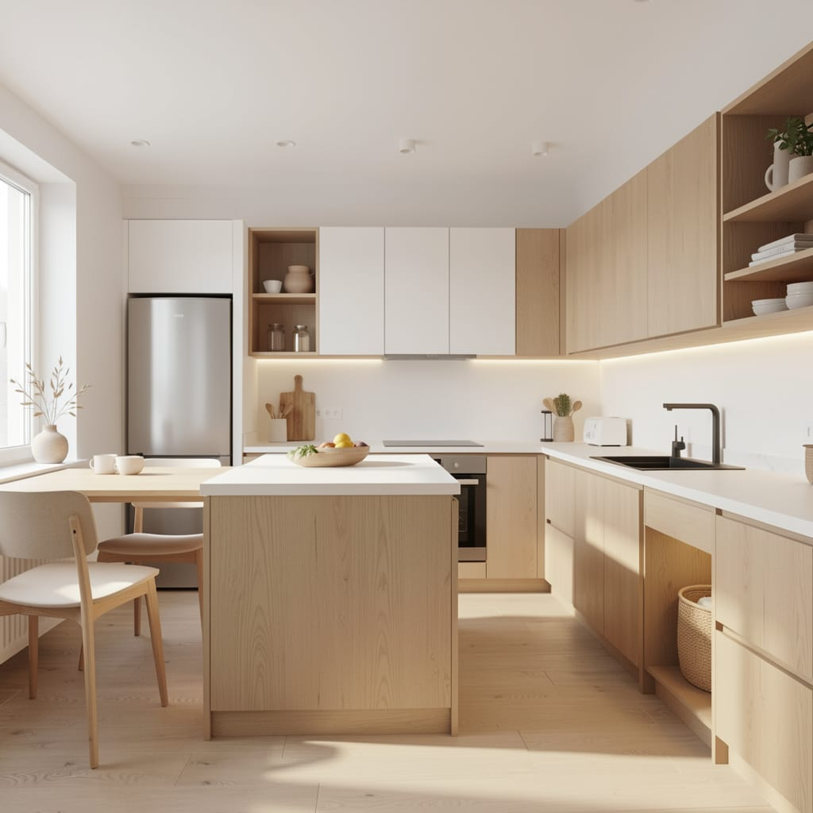

# De la idea a la cocina — Asistente de conceptos con IA para Daruma Deco

**Proyecto Final · _IA: Entretejiendo Imaginación y Algoritmos_**

- **Autor:** Lautaro Taiel Domínguez
- **Comisión:** 96165
- **Materia:** Inteligencia Artificial: Generación de Prompts
- **Caso de estudio:** [Daruma Deco](https://instagram.com/darumadeco_) · muebles a medida (cocinas)

---

## Resumen

Daruma Deco fabrica muebles a medida, por lo que su producto no existe hasta que se construye:
el cliente no puede *ver* su cocina antes de comprometerse, y esa incertidumbre frena la venta.
Este proyecto propone un asistente basado en *prompt engineering* que, a partir del mensaje informal
de un cliente, genera en una sola pasada un **pack de venta**: un brief ordenado, un **prompt de imagen**
para obtener un concepto visual de la cocina (texto→imagen) y los **textos** para responder por WhatsApp
e Instagram (texto→texto).

La prueba de concepto está implementada en una Jupyter Notebook que aplica técnicas de **fast prompting**
(rol, delimitadores, few-shot, salida estructurada en JSON y, sobre todo, la unificación del flujo en una
**única llamada** a la API). El texto se resuelve con la API de OpenAI (`gpt-4o-mini`) y la imagen, sin
costo, con **Nightcafe**. El resultado: el pedido difuso de un cliente se transforma en un concepto visual
y en textos listos para usar, de forma rápida, ordenada y económica.

---

## Introducción

### Nombre del proyecto
**De la idea a la cocina** — asistente de conceptos visuales con IA para Daruma Deco.

### Problema a abordar
Daruma Deco fabrica muebles **a medida**: el producto **no existe hasta que se fabrica**. En las cocinas
—el producto más destacado y el de mayor carga económica y emocional— hay una **brecha grande entre lo que
el cliente dice y lo que logra imaginar**. Un mensaje como *"quiero algo moderno, blanco con madera, cálido,
no sé si entra una isla"* no devuelve ninguna imagen concreta. Esa incertidumbre frena la decisión,
desalinea expectativas y obliga al emprendimiento a invertir tiempo describiendo ideas o buscando fotos
sueltas. Es **relevante** resolverlo porque una referencia visual temprana alinea al cliente con el taller,
acelera la venta, reduce el retrabajo y genera material para las redes que Daruma ya produce.

### Propuesta de solución y vínculo con la IA
Un asistente basado en prompts que combina los **dos modelos del curso**:

- **Texto→texto** (OpenAI, `gpt-4o-mini`): ordena el pedido y produce el brief, el prompt de imagen y los copys.
- **Texto→imagen** (**Nightcafe**): genera el concepto visual de la cocina a partir de ese prompt.

**Decisión de alcance clave:** la imagen es una **referencia de estilo y clima**, no un plano ni un render de
fabricación. Por eso las variables se separan en dos grupos: las **visuales** (estilo, materiales, colores,
iluminación) alimentan la imagen; las **técnicas** (medidas, restricciones) se registran como dato interno
para la fabricación, pero **no** se le piden al modelo de imagen (no las respeta).

Los prompts se organizan en etapas, unificadas en una sola llamada:
1. **Intake** — ordena el mensaje del cliente en un brief (visual / técnico / falta confirmar).
2. **Prompt de imagen** — construye el prompt en inglés + negative prompt (sin medidas).
3. **Comunicación** — redacta el mensaje de WhatsApp y el caption de Instagram.

### Viabilidad
Realizable con recursos accesibles y sin infraestructura compleja: se ejecuta en una notebook, con la API de
OpenAI para el texto (fracciones de centavo por consulta) y una herramienta **gratuita** (Nightcafe) para la
imagen. Las cuentas nuevas de OpenAI incluyen **USD 5 de crédito gratis**, suficiente para toda la POC.
El alcance está acotado a un caso real (cocinas) y a un flujo optimizado a **una sola llamada** por cliente.

> **Nota de contexto:** DALL·E 3 fue **retirado de la API de OpenAI el 12/05/2026**; por eso la imagen se
> genera en **Nightcafe** (gratis) escribiendo el prompt directamente en la herramienta, como pide la consigna.

---

## Objetivos

**General:** demostrar, con una POC funcional, cómo el *fast prompting* resuelve el problema de
pre-visualización de cocinas de forma eficaz y **rentable** (mínimas llamadas a la API).

**Específicos:**
1. Aplicar técnicas de *fast prompting* (rol, delimitadores, few-shot, salida estructurada, restricciones).
2. **Unificar** el flujo de 4 etapas de las entregas previas en **una sola llamada**.
3. Experimentar con distintas configuraciones (con/sin few-shot) y medir su impacto en costo y fiabilidad.
4. Comparar el costo del enfoque encadenado vs. el optimizado.
5. Resolver el texto→imagen con una herramienta gratuita (Nightcafe) e integrar la imagen a la notebook.

---

## Metodología

1. **Fraccionar el problema** en etapas (intake → prompt de imagen → copy) para entenderlo.
2. **Prototipar** cada prompt en ChatGPT antes de llevarlo a código.
3. **Optimizar (fast prompting):** unificar las etapas en **un único prompt** que devuelve un **JSON** con
   todo el pack, reduciendo de 4 llamadas a 1.
4. **Instrumentar el costo:** contar llamadas y estimar tokens para comparar enfoques.
5. **Modo demo:** un interruptor (`MODO_DEMO`) permite revisar la notebook con una respuesta de ejemplo,
   sin gastar llamadas ni requerir API key; al desactivarlo, se conecta a la API real.
6. **Imagen fuera de la API:** el prompt se pega en Nightcafe y la imagen resultante se guarda en `salidas/`
   y se embebe en la notebook (código + texto + imagen en un mismo lugar).
7. **Validación con el caso real:** el criterio de los dueños de Daruma valida si los conceptos son realistas.

---

## Herramientas y tecnologías

**Stack:** Python · Jupyter Notebook · API de OpenAI (`gpt-4o-mini`, texto) · Nightcafe (imagen).

**Técnicas de *fast prompting* utilizadas (y por qué):**

| Técnica | Para qué sirve en este proyecto |
|---|---|
| **Rol / persona** | El modelo responde como asistente de Daruma: tono y contexto correctos. |
| **Delimitadores (`"""`)** | Aíslan el mensaje del cliente de las instrucciones: claridad y seguridad ante inyección. |
| **Salida estructurada (JSON)** | Claves fijas → se parsea directo y habilita la automatización. |
| **Few-shot (1 ejemplo)** | Fija formato y estilo, reduce reintentos. Es una **palanca** de costo/fiabilidad. |
| **Restricciones anti-alucinación** | "No inventes medidas; lo que falte va en `falta_confirmar`". |
| **Prompt único** | Devuelve las etapas juntas → **1 llamada** en lugar de 4 (clave de la rentabilidad). |
| **Parámetros** | `response_format=json_object` (evita reintentos), `max_tokens` acotado y `temperature` moderada. |

**¿Por qué `gpt-4o-mini`?** Es el modelo de texto más económico de OpenAI (USD 0,15/0,60 por millón de
tokens de entrada/salida) y sobra para una tarea de estructuración y redacción como esta.

---

## Implementación

Todo el código está en **[`daruma_poc.ipynb`](daruma_poc.ipynb)**, organizado en secciones:
configuración, técnicas + prompt del sistema + few-shot, corrida principal, análisis de costo, imagen
(prompt para Nightcafe + imagen embebida), interactividad y conclusión.

**Texto→texto:** una sola llamada a `gpt-4o-mini` devuelve el pack completo en JSON.

**Texto→imagen (sin API):** el prompt de imagen que produce la etapa de texto se pega en Nightcafe.

- **Prompt usado:**
  ```
  Photorealistic interior of a small Scandinavian apartment kitchen, linear galley layout,
  white matte cabinetry with light natural oak wood fronts, light stone countertop, warm LED
  under-cabinet lighting, bright and airy atmosphere, soft natural daylight, minimalist and
  cozy, wide angle, high detail
  ```
- **Negative prompt:** `text, watermark, people, clutter, distorted proportions`
- **Imagen resultante:** [`salidas/concepto_cocina_nordica.jpg`](salidas/concepto_cocina_nordica.jpg)



---

## Resultados

- A partir de un mensaje real y desordenado, la implementación devuelve **en una sola llamada** un pack
  completo: brief (con lo visual separado de lo técnico y lo que falta confirmar), prompt de imagen en
  inglés **sin medidas**, y los textos de WhatsApp e Instagram.
- El **prompt de imagen** pegado en Nightcafe produjo un concepto **realista y fiel al brief**: cocina
  nórdica, blanco con madera clara, isla, LED cálido y ambiente luminoso (ver imagen).
- **Optimización de costo:** el flujo pasó de un encadenado de **4 llamadas** a **1 sola** (75% menos
  requests por cliente). En tokens, unificar ahorra el contexto repetido del encadenado; el few-shot vuelve
  a sumar entrada, por lo que se lo trata como una palanca ajustable (con/sin few-shot).

| Enfoque | Llamadas | USD / cliente (estimado) |
|---|---|---|
| Naïve (encadenado) | 4 | ~0,00036 |
| Optimizado + few-shot | **1** | ~0,00036 |
| Optimizado sin few-shot | **1** | ~0,00031 |

La solución **llega al resultado esperado**: convierte el pedido difuso de un cliente en un concepto visual
y textos de venta usables, de forma rápida y económica.

---

## Conclusiones

- Se cumplieron los objetivos: se aplicaron técnicas de *fast prompting* y se **unificó el flujo en una sola
  llamada**, haciéndolo rentable a escala.
- La **separación entre variables visuales y técnicas** resultó clave: se le pide a cada modelo solo aquello
  en lo que es bueno, y la imagen se posiciona correctamente como **referencia de estilo**, no como render final.
- El experimento **con/sin few-shot** mostró que la fiabilidad tiene un costo en tokens: es una decisión de
  diseño, no una verdad absoluta. Ese análisis fue una de las mejoras respecto de las entregas anteriores.
- **Limitaciones:** el modelo de imagen no reproduce el espacio real ni las medidas; hoy el uso es
  semi-manual (alguien de Daruma corre el flujo y responde por WhatsApp). El criterio humano sigue siendo
  el filtro final.
- **Trabajo futuro:** automatizar la atención por WhatsApp Business, sumar un tercer modelo texto→audio y/o
  una interfaz de usuario simple.

---

## Referencias

- OpenAI — Precios de la API: <https://openai.com/api/pricing>
- OpenAI Help Center — Creación y edición de GPTs / retiro de modelos: <https://help.openai.com/en/articles/8554397-creating-and-editing-gpts>
- Nightcafe — Generador de imágenes: <https://creator.nightcafe.studio>
- Jupytext — Notebooks como scripts: <https://jupytext.readthedocs.io>
- Documentación de Jupyter: <https://docs.jupyter.org>

---

## Cómo ejecutar

```bash
git clone <URL-de-tu-repo>
cd daruma-fast-prompting
python -m venv .venv && source .venv/bin/activate   # Windows: .venv\Scripts\activate
pip install -r requirements.txt
jupyter notebook daruma_poc.ipynb
```

- **Modo demo (sin costo):** dejá `MODO_DEMO = True`. Corre con una respuesta de ejemplo.
- **Modo real (API):** conseguí una API key en <https://platform.openai.com>, cargala como variable de
  entorno (`export OPENAI_API_KEY="sk-..."`) y poné `MODO_DEMO = False`. La imagen se genera igual en Nightcafe.

---

## Estructura del repositorio

```
daruma-fast-prompting/
├── README.md
├── daruma_poc.ipynb      # POC (notebook con código, texto e imagen embebida)
├── daruma_poc.py         # misma notebook en formato script (jupytext)
├── requirements.txt
├── .env.example
├── .gitignore
└── salidas/
    └── concepto_cocina_nordica.jpg   # imagen generada en Nightcafe
```
